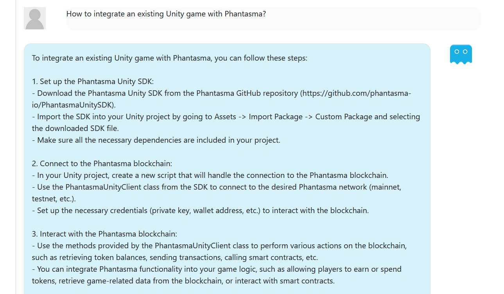

# PhantasmaAI 🌌
A powerful conversation chatbot powered by GTP technology to assist in creating dapps, smart contracts, and handling other blockchain tasks. Developed in C#.

 *<sub>PhantasmaAI in action!</sub>*

---

## 🚀 Features

- Guided help for creating decentralized applications (dapps).
- Smart contract generation and recommendations.
- Blockchain task automations.
- Fluid conversation capabilities using GTP technology.
- Secure and reliable C# backend.

## 🔍 Prerequisites

- .NET Core 3.1 or above.
- OpenAI API key.

## 🛠️ Setup & Installation

1. **Clone the LunarBot**

    ```bash
    git clone git@github.com:Relfos/LunarBot.git
    ```

2. **Clone the Repository**

    ```bash
    git clone git@github.com:phantasma-io/PhantasmaAI.git
    cd PhantasmaAI
    ```

3. **Setup OpenAI API Key**

   Create a file named `apikey.txt` in the `www/` directory of the project. Paste your OpenAI API key into this file and save it.

4. **Install Dependencies**

    ```bash
    dotnet restore
    ```

5. **Run PhantasmaAI**

    ```bash
    dotnet run
    ```

## 📖 Usage

After running the project, PhantasmaAI will guide you through the process of creating dapps or smart contracts. Simply follow the conversation prompts to navigate through its capabilities.

**Example:**

User: I want to create a new smart contract.
PhantasmaAI: Great! What functionality do you want in your smart contract?

## 🛡️ Security

Ensure you keep your `apikey.txt` confidential. Never expose it in public repositories or other public places.

## 🌐 Contribute

Contributions, issues, and feature requests are welcome! Feel free to check the [issues page](https://github.com/phantasma-io/PhantasmaAI/issues).

## 🤖 Credits

- GTP technology by OpenAI.
- Developed by [Your Name](https://github.com/relfos) and the Phantasma team.

## 📄 License

This project is [MIT](https://opensource.org/licenses/MIT) licensed.

---

Give PhantasmaAI a ⭐ if you find it helpful! It helps us stay motivated. 🌌
